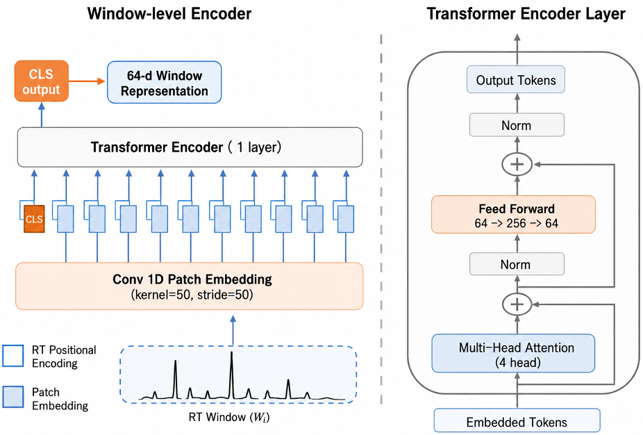
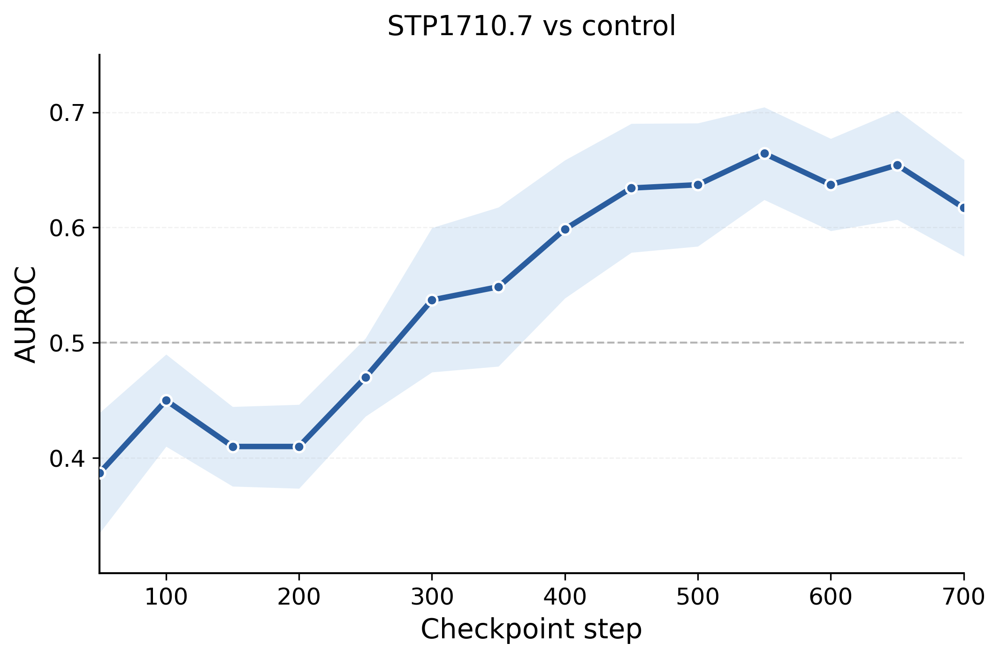
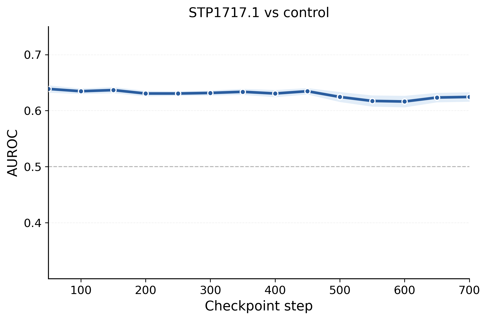
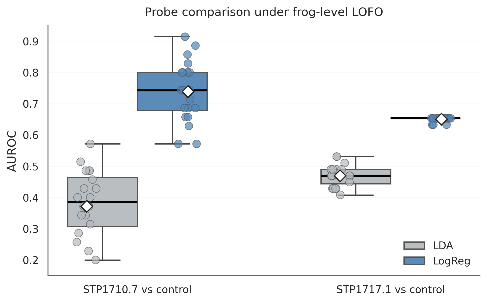
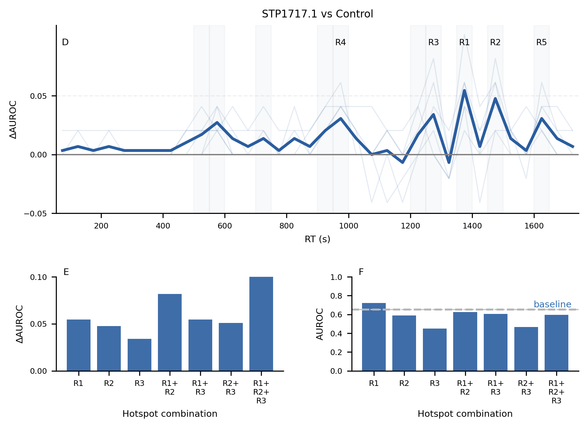
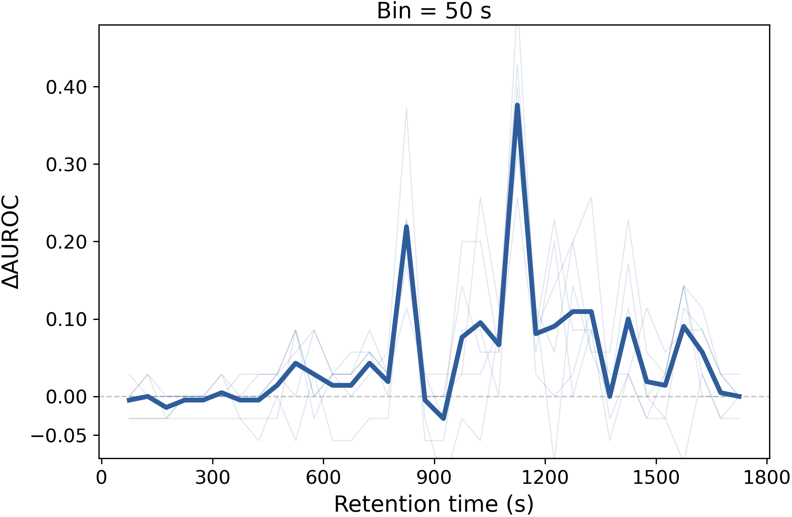
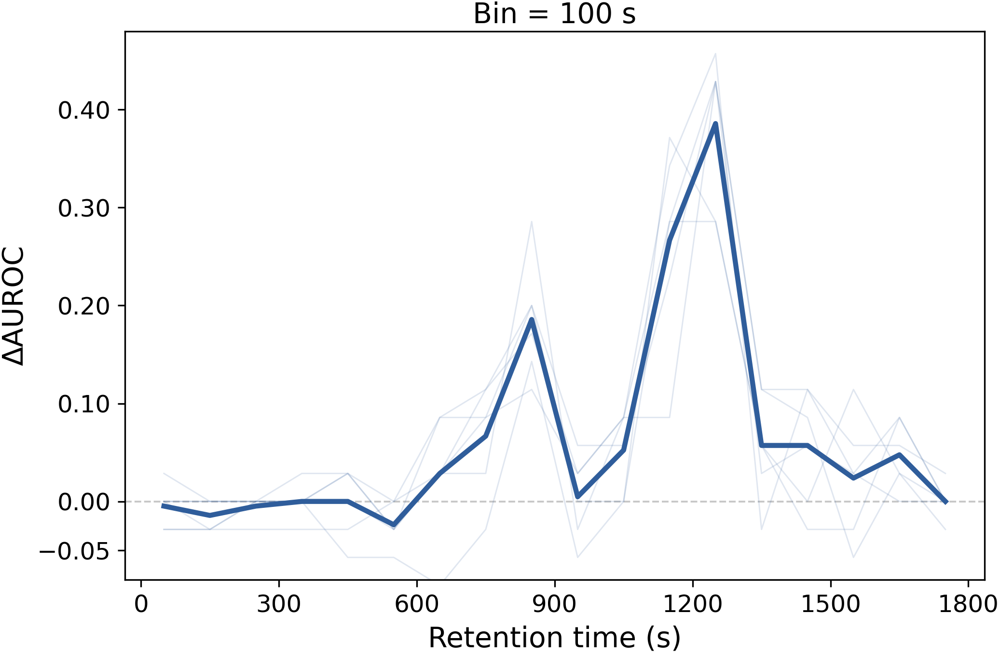

# Supplementary Figures

This directory contains additional figures for the paper:

> **Localizing Discriminative Retention-Time Regions in LC-MS MS1 Signals via Contrastive Representation Learning**  
> Junhui Shen, Donald M. Walker, and Joshua L. Phillips  
> ICTAI 2026

These figures were omitted from the five-page camera-ready paper because of the page limit. They provide additional architectural details, model-selection results, classifier comparisons, and ablation robustness analyses. The figure labels used below are descriptive and are independent of the numbering in the camera-ready paper.

## Window-level encoder architecture

**File:** [`figures/window_encoder.png`](figures/window_encoder.png)

Detailed architecture of the window-level encoder. Each retention-time (RT) window is converted into patch embeddings using a one-dimensional convolution with kernel size and stride of 50. RT positional encodings and a learnable CLS token are added before a single-layer Transformer encoder with four attention heads. The CLS output provides the 64-dimensional window representation. The right panel shows the internal Transformer encoder layer.

## Checkpoint-selection dynamics

### STP1710.7 versus control

**File:** [`figures/checkpoint_dynamics_STP1710_final.png`](figures/checkpoint_dynamics_STP1710_final.png)

Frog-level leave-one-frog-out (LOFO) AUROC across representation-learning checkpoints for STP1710.7 versus control. The curve shows the mean across random seeds, and the shaded region shows the corresponding uncertainty interval. Performance generally improves during training before stabilizing at later checkpoints.

### STP1717.1 versus control

**File:** [`figures/checkpoint_dynamics_STP1717_final.png`](figures/checkpoint_dynamics_STP1717_final.png)

Frog-level LOFO AUROC across representation-learning checkpoints for STP1717.1 versus control. Performance remains comparatively stable across checkpoints, with less checkpoint-to-checkpoint variation than for STP1710.7.

## Linear-probe classifier comparison

**File:** [`figures/LR_LDA.png`](figures/LR_LDA.png)

Comparison of logistic-regression and linear-discriminant-analysis probes under frog-level LOFO evaluation. Each point represents a random seed, the boxes summarize the distributions, and the diamond markers indicate the means. Logistic regression provides higher AUROC than LDA for both treatment comparisons.

## RT-region ablation for STP1717.1 versus control

**File:** [`figures/ablation_LR_1717.png`](figures/ablation_LR_1717.png)

RT-region ablation results for STP1717.1 versus control, aggregated across the top 30% of models ranked by frog-level LOFO AUROC. The upper panel shows the change in AUROC after masking individual RT bins; thin lines represent individual models and the thick line represents their mean. R1-R5 denote the top-ranked intervals. The lower panels show the AUROC decrease after masking selected regions and the AUROC obtained when only the selected regions are retained. The dashed line in the region-only panel denotes the full-signal baseline.

## Robustness to RT-bin width

### 50-second bins

**File:** [`figures/1710_bin_50_mask.png`](figures/1710_bin_50_mask.png)

Masked-region importance profile for STP1710.7 versus control using 50-second RT bins.

### 100-second bins

**File:** [`figures/1710_bin_100_mask.png`](figures/1710_bin_100_mask.png)

Masked-region importance profile for STP1710.7 versus control using 100-second RT bins. The major peak locations are consistent with those obtained using 50-second bins, indicating that the principal high-importance RT intervals are not unique to a single binning resolution.

## Notes

- AUROC denotes the area under the receiver operating characteristic curve.
- LOFO denotes leave-one-frog-out evaluation.
- The self-supervised encoder is pretrained using the available unlabeled chromatograms and then frozen for downstream evaluation. Consequently, the LOFO evaluation is transductive with respect to representation learning and does not measure generalization to frogs unseen during pretraining.
- Selection of the top 30% of models by LOFO AUROC may amplify the apparent stability of the identified RT regions; this should be considered when interpreting the ablation profiles.
